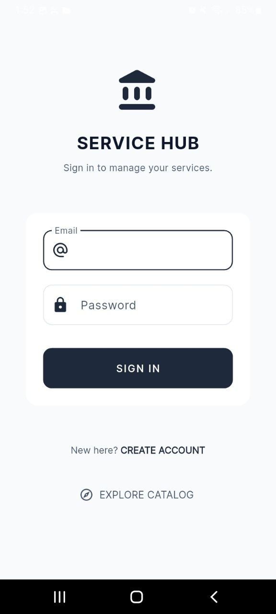
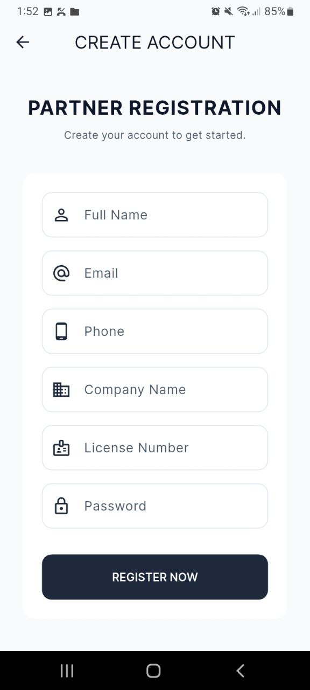
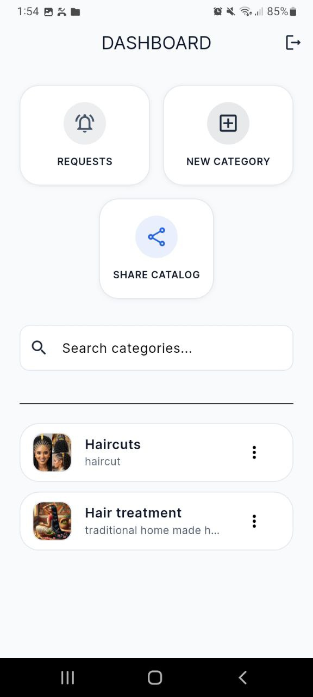
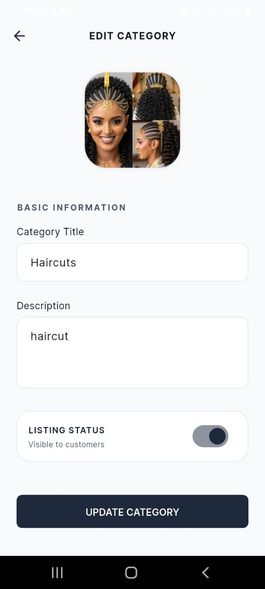
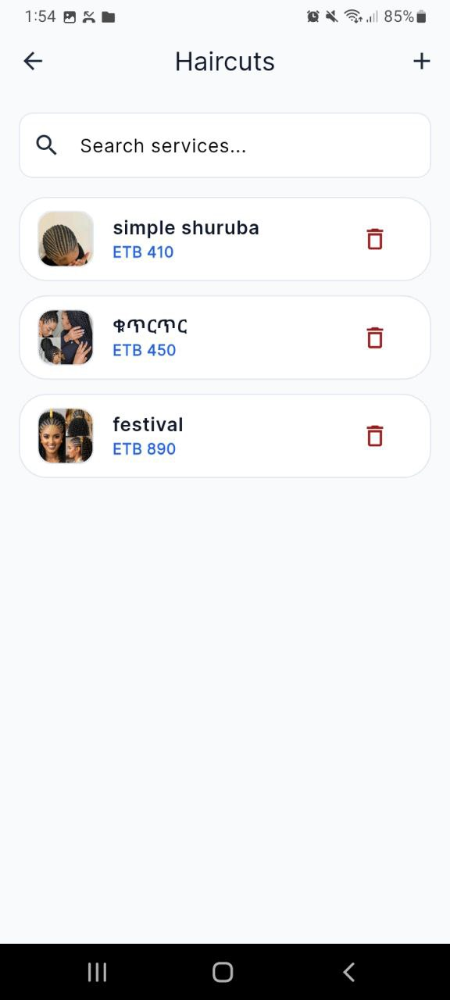
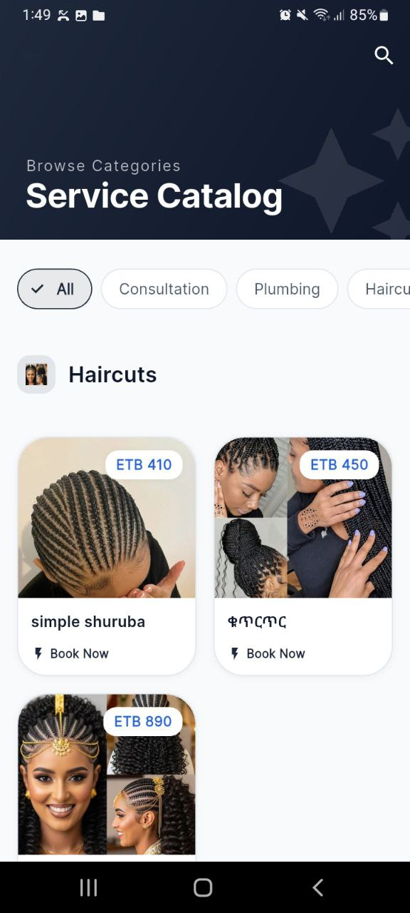
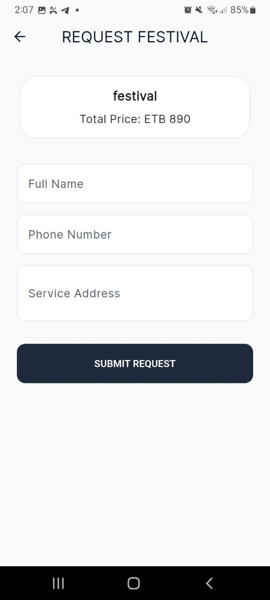

# Service Hub: Mini Service Catalog & Request App

A premium Flutter application built for the **Qelem Meda Technologies Internship Practical Assessment**. This app allows service providers to manage their offerings and customers to submit requests seamlessly.

---

## � App Showcase

### 1. Provider Login & Registration
*Secure access for service providers with automated profile creation.*




### 2. Provider Dashboard
*Management hub for categories, services, and incoming requests.*



### 3. Category & Service Management
*Full CRUD capabilities for maintaining a professional catalog.*




### 4. Public Catalog (Customer View)
*Clean, real-time catalog for customer exploration.*



### 5. Request Submission
*Simple and intuitive form for customers to book services.*



---

## 🛠 Tech Stack
- **Framework**: Flutter
- **Backend**: Firebase (Auth & Firestore)
- **Media**: Catbox.moe Integration
- **Style**: Executive Professional (Inter Font)

## 📥 Setup
```bash
flutter pub get
flutter run
```

## 🧪 Seeding & Test Data
The seeder has already pre-populated the following test accounts:
- **User 1**: `keneanhailu@gmail.com`
- **User 2**: `hailukenean@gmail.com`
- **Common Password**: `hakfm12345`

---
*Built for Qelem Meda Technologies internship test.*
